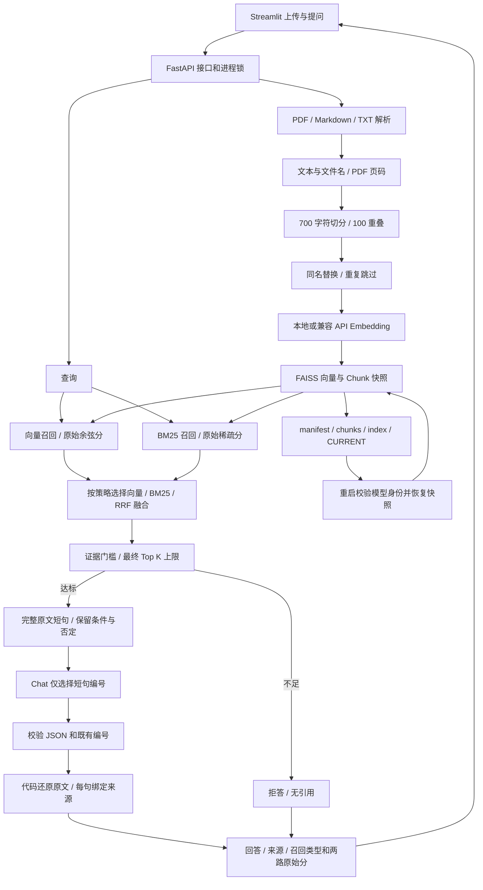
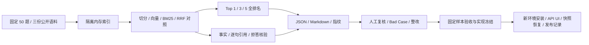

# TraceRAG 系统架构

- 适用范围：V0.2 在线链路与离线评测
- 整理日期：2026-10-04

## 在线导入与问答

RRF 分用于排序；拒答依据原始余弦或 BM25 门槛。模型不生成最终自由文本，程序验证短句编号后还原来源文字。上传更新后重新构建稀疏表，避免两路检索使用不同版本的文档。

## 评测与交付

评测数据与运行知识库隔离，历史失败批次保留。工程验收中的固定模型服务只验证交付链路；真实质量依据 [50 题最终验收](../版本记录/V0.2/001_版本总结.md)。

## 模块责任

| 模块 | 责任 |
| --- | --- |
| `document_loader` / `chunking` | 文本解析、切分和来源保留 |
| `embeddings` / `vector_store` | 向量编码、快照保存、身份兼容检查 |
| `retriever` / `relevance` | 两路召回、RRF 与证据门槛 |
| `grounded_answer` / `citations` | 独立的原文编号和逐句引用校验 |
| `chat` / `rag` | 模型协议与回答、拒答编排 |
| `runtime` / `api` | 入库、恢复、并发锁和 HTTP 错误映射 |
| `evaluation` / `evaluate_v02` | 事实评分、引用核验和离线对照 |
| `delivery_smoke` | 独立进程的工程交付验收 |

当前索引持久化为本地快照文件，无多进程共享写入协调；API 保持单进程，扩容前需要独立存储和并发方案。
